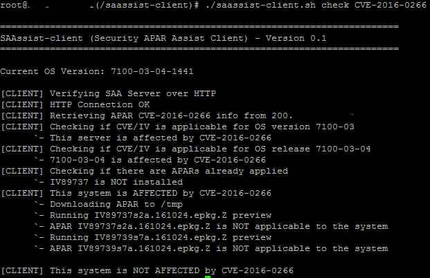
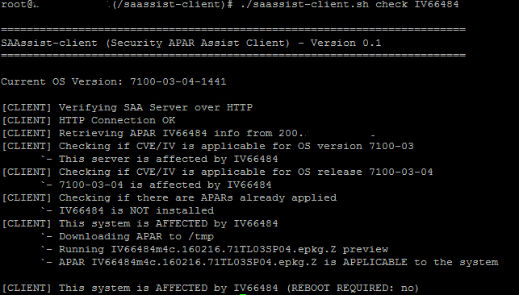
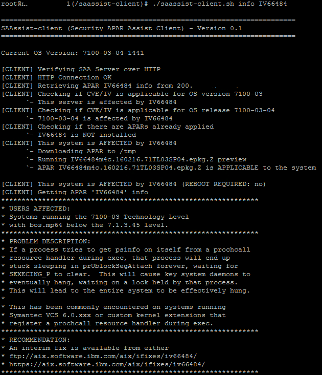
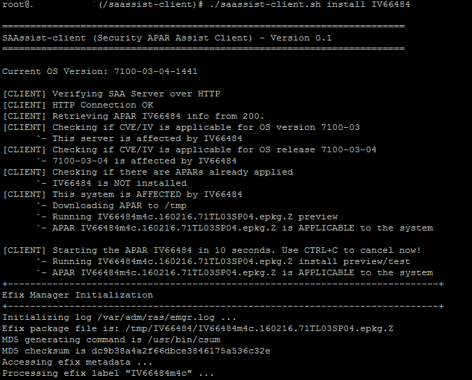
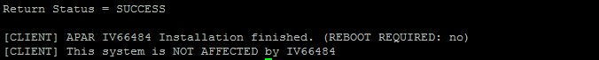

***********************
Security APAR Assistant
***********************

:SAAssist: Security APAR Assistant
:License: Apache 2.0
:Development: https://github.com/SAAssist/

.. contents::
    :local:
    :depth: 3
    :backlinks: none

Overview
********

Security APAR Assist (SAAssist) is a tool to controls security APARs for IBM
AIX and IBM PowerVM environment.

There are two basic components on SAAssist, SAAssist Server (saassist-server)
and SAAssist Client (saassist-client).

This is a Open Source software licensed by Apache License 2.0.

Remark: To check the full documentation about saassist-server, please check out
the README.rst of SAAssist Server at http://github.com/SAAssist/saassist-server

Important:

The Security APAR Assistant (including saassist-server and saassist-client) is
not an IBM Inc. software and it is not supported or guaranteed by IBM.

IBM AIX, IBM PowerVM and IBM Fix Level Recommended Tool website are registered
trademarks of IBM Corporation in the United States, other countries, or both.

How it works
************

SAAssist Server (saassist-server) is the tool that works directly with the IBM
Fix Level Recommendation Tool (FLRT) website (
https://www-304.ibm.com/support/customercare/flrt/) and it creates a repository
with APARs information and packages based on CVE or IV number.

Those APARs information and packages are accessed by SAAssist Client
(saassist-client) by HTTP or NFS protocol and checks if the APAR affect the
server and if it can be installed.

Only the SAAssist Server needs to access the IBM FLRT website, proxy is also
supported and it can be used.
AAssist Client needs to access only SAAssist Server by HTTP or NFS.

Schema overvivew
 .. code-block::

     _________________
    |                 | --------------[ Internet ]--------[ IBM FLRT website ]
    | saassist server |               * web proxy
    |_________________|
            |
            |
            `----- [  Repository  ]
                   [  info, fixes ]
                   [  HTTP: :NFS  ]
                           |
            .--------------'
            |
    ________|_________
    |                 |
    | saassist client |
    |_________________|
            |
            |
            |`---- {check}    verifies if APAR is applicable & boot required
            |
            |`-----{info}     gets detailed information about APAR (asc file)
            |
             `-----{install}  installs APAR

    saassist-server: it can be an AIX, Linux or MacOS with Internet access
                     directly or through proxy.

    saassist-client: AIX or PowerVM server

SAAssist Client (saassist-client)
=================================

The SAAssist Client (saassist-client) is written in Korn Shell (ksh).

This is a simple ksh script that accesses the SAAssist Server (saassist-server)
using HTTP or NFS protocol and collects information about a specific APAR
(CVE/IV), checks if it is applicable for the server, provides detailed
information and installs the fix if required by you.

Using NFS procotol, there is no requirements. Curl is required if you want to
use saassist-client through HTTP procotol.

Using saassist-client
---------------------

The saassist-server is simple to use. You need to run the
saassist-client.sh with the actions (parameters) that you want to perform and
specify the CVE or IV Number.

To get full help use: ``saassist-client.sh help``

* check   : Verifies if the system is affected by CVE/IV
* info    : Shows details about the CVE/IV
* install : Installs the APAR if it is available and applicable to the system

Example:

  ``saassist-client check CVE-2016-0281``

  ``saassist-client info IV91004``

  ``saassist-client install CVE-2016-0281``

Screenshots
^^^^^^^^^^^

* Checking

not affected

affected

* Reading info

* Install APAR/Fix

SAAssist Client (saassist-client) Installation
**********************************************

If you want to use HTTP protocol, remember the package curl is required for IBM
AIX/PowerVM.

Download the saassist-client from the link, extract the files and edit
client_config file.

1. Download

    http://github.com/SAAssist/saassist-client

2. Extract the files

    .zip ``unzip saassist-client[version].zip``

    .tar ``tar xvf saassist-client[version].zip``

4. Configure the client_config

    Please check the comments inside the config file

    ``vi client_config``

Reporting bugs and improvements
*******************************

SAAssist Client https://github.com/SAAssist/saassist-client/issues

Contributing
************

Please check out the saassist-server README.rst
http://github.com/SAAssist/saassist-server/README.rst